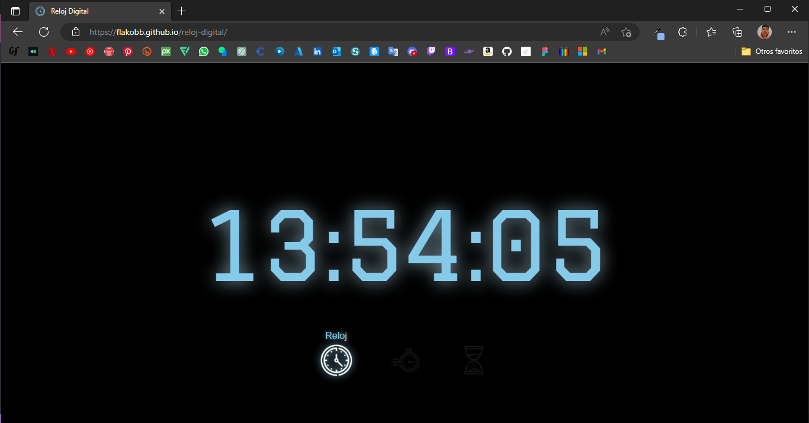

# **Reloj Digital**



Ver el [despliegue](https://flakobb.github.io/reloj-digital/)

---

## **Detalles**

Esta **aplicacion web** perimite al usuario visualizar la hora actual en un **reloj**, utilizar un **cronometro** y establecer un **temporizador**.

Al entrar a la pagina, el usuario verá el reloj con la hora actual y tres botones que permiten desplazarce hacia las otras aplicaciones (crronometro y temporizador)

Tanto el cronometro como el temporizador cuentan con su respectivo grupo de botones con los que se pueden controlar.


### **Programación**

La programacion de esta aplicacion es totalmente usando JavaScript.

Cada seccion de esta aplicación (Reloj, Cronometro y Temporizador) fueron programados en clases propias en modulos individuales.

En el archivo principal se importan las clases de cada seccion, se inician las funciones primarias y se ponen a la escucha las funciones como:

 - Navegacion entre secciones.
    - Controles por botones en pantalla
    - Controles por teclado

- Controles del cronometro

- Controles del temporizador


### **Reloj**

La seccion del reloj unicamente permite viasualizar la hora actual en un formato de 24 horas.

Fue programada utilizando un un intervalo que se ejecuta cada segundo y cada vez que se ejecuta actualiza el display con la hora actual.


### **Cronometro**


El cronometro cuenta con tres botones de control:

 - **Iniciar:** como su nombre lo indica, ejecuta la funcion que inicia un intervalo que se repite cada milisegundo actualizando el display cada vez hasta que el usuario presione alguno de los otros botones.

 - **Detener:** este boton reinicia todas las variables dejando visible en el display el tiempo transcurrido desde que se inicio el cronometro hasta que se epresiono este boton.

 - **Reiniciar:** con el boton reiniciar, no solamente devuelve a todas las variables su valor inicial, sino que tambien coloca el display en '00:00:00:000'.

#### **Funcionamineto del cronometro**

La funcion que inicia el cronometro, primero obtiene el timestamp actual para despues iniciar un intervalo que cada milisegundo vuelve a obtener el timestamp y le resta el primer timesamp para medir el tiempo transcurrido desde entonces; al mismo tiempo llama a la funcion que actualiza el display con el tiempo que ha pasado.

```JavaScript
iniciarCrono() {
        if(!this.inicio) { // verifica que el cronometro este en cero (00:00:00:000)
            this.inicio = Date.now() // guarda el timestamp al momento de iniciar el cronometro
            this.intervalo = setInterval(() => { // inicia un intervalo
                this.transcurrido = Date.now() - this.inicio // resta el timestamp guardado al inicio al timestamp actual
                this.mostrarTiempo() // llamada a la funcion que actualiza el display
            }, 1) // el intervalo se repite cada milisegundo
        }
    }
```

La funcion para actualizar el display convierte el timestamp a un formato de horas:minutos:segundos:milisegundos y lo muestra en el display.

```JavaScript
mostrarTiempo() {
        const horas = Math.floor(this.transcurrido / 3600000)
        const minutos = Math.floor((this.transcurrido % 3600000) / 60000)
        const segundos = Math.floor((this.transcurrido % 60000) / 1000)
        const mili = this.transcurrido % 1000

        this.dis_crono.textContent = `${horas}:${minutos}:${segundos}:${mili}`
    }
```

La funcion para detener el cronometro unicamente limpia el intervalo.

```JavaScript
detenerCrono() {
        clearInterval(this.intervalo)
    }
```

Por ultimo, está la funcion para reiniciar el cronometro que evalua que se haya iniciado y de ser así, limpia el intervalo y devuelve a las variables su valor inicial.

```JavaScript
reiniciarCrono() {
        if(this.inicio) { // evalua que se haya iniciado el cronometro
            clearInterval(this.intervalo) // limpia el intervalo
            // reseteea las variables
            this.inicio = null
            this.intervalo = null
            this.dis_crono.textContent = '00:00:00:000'
        }
    }
```


### **Temporizador**


El temporizador tiene dos botones de control:

 - **Iniciar:** al aver establecido un tiempo, comenzará a hacer un conteo regresivo hasta llegar a 0.

 - **Borrar:** este boton tiene dos funcionalidades:
     - Cuando el cronometro esta corriendo, lo detendra y reseteará las variables.
     - Cuando el temporizador haya llegado a 0, este boton detendra la alarma y la animacion de alerta que ejecuta el temporizador, ademas reseteará las variables.

Para establecer un temporizador, el usuario debera presionar las teclas numericas de su teclado y verá como se coloca el tiempo en el display del temporizador. Tambien existe la posibilidad de activar el teclado numerico en pantalla presionando el botón con la imagen de teclado.

Cuando el usuario presiona un numero, se ejecuta una funcion que guarda la cadena actual del display en un arreglo, a ese arreglo le indicamos que borre el elemento en el indice 0 y al mismo tiempo agregue el numero que presiono el usuario al final del arreglo.

```JavaScript
agregarNumero(numero) {
        if(this.contador < 6) { // evalua que el usuario no ingrese mas de 6 numeros
            this.contador++ // por cada numero ingresado el contador aumenta en 1
            this.arreglo_nums.shift() // elimina el primer elemento del arreglo
            this.arreglo_nums.push(numero) // agrega el nuevo numero al final del arreglo
    
            let cadena1 = this.arreglo_nums.join('') // crea una cadena con todos los elementos del arreglo (6 numeros)
            let cadena2 = cadena1.match(/.{1,2}/g).join(':') // crea una nueva cadena separando grupos de dos numeros con ':'
    
            this.dis_tempo.textContent = cadena2 // actualiza el display con la nueva cadena
        }
    }
```

Si el usuario quiere borrar lo que acaba de ingresar, puede hacerlo presionando la techa de borrar en su teclado. Al hacerlo, ejecutara una funcion que guarda la cadena actual del display en un arreglo, a ese arreglo le indicamos que borre el ultimo elemento y a la vez agregue un '0' al inicio.

```JavaScript
borrarNumero() {
        if(this.contador > 0) { // evalua que el usuario haya guardado al menos un numero
            this.contador-- // el contador decrementa para premitir al usuario escribir otro numero
            this.arreglo_nums.pop() // elimina el ultimo elemento del arreglo
            this.arreglo_nums.unshift('0') // agrega un '0' al inicio del arreglo

            let cadena1 = this.arreglo_nums.join('') // crea una cadena con todos los elementos del arreglo (6 numeros)
            let cadena2 = cadena1.match(/.{1,2}/g).join(':') // crea una nueva cadena separando grupos de dos numeros con 
        
            this.dis_tempo.textContent = cadena2 // actualiza el display con la nueva cadena
        }
    }
```

Cuan el usuario ha establecido un tiempo y presiona el boton "Iniciar", se ejecutará una funcion que tomara el tomara el tiempo ingresado por el usuario, lo redondeara a un formato de horas:minutos(max:60):segundos(max:60) y comenzara la cuenta regresiva con un intervalo de tiempo de un segundo.

```JavaScript
iniciarTempo() {
        if(this.timer !== '00:00:00' && !this.intervalo) { // evalua que el tiempo actual no sea 0 y que no se este ejecutando un intervalo

            // separa el tiempo ingresado por el usuario en tres variables numericas
            let arreglo_timer = this.timer.split(':')
            this.horas = parseInt(arreglo_timer[0])
            this.minutos = parseInt(arreglo_timer[1])
            this.segundos = parseInt(arreglo_timer[2])
            
            // si la variable de los segundos es mayor a 60 divide entre 60 para agregar a los minutos y se queda el restante como segundos
            if(this.segundos > 60) {
                let nuevos_minutos = Math.floor(this.segundos / 60)
                this.segundos = this.segundos % 60
                this.minutos += nuevos_minutos
            }

            // si la variable de los minutos es mayor a 60 divide entre 60 para agregar a las horas y se queda el restante como minutos
            if(this.minutos > 60) {
                let nuevas_horas = Math.floor(this.minutos / 60)
                this.minutos = this.minutos % 60
                this.horas += nuevas_horas
            }

            // Inicia un intervalo de tiempo de un segundo que diminuye en 1 la variable de los segundos tomando en cuenta la cantidad de horas y minutos disponibles
            this.intervalo = setInterval(() => {
                if(this.minutos === 0 && this.horas > 0) {
                    this.horas--
                    this.minutos = 60
                }
                if(this.segundos === 0 && this.minutos >= 0) {
                    this.minutos--
                    this.segundos = 60
                }
                this.segundos--

                // evalua si el contador ha llegado a 0 total (0 horas, 0 minutos y 0 segundos)
                if(this.segundos === 0 && this.minutos === 0 && this.horas === 0) {
                    document.body.classList.add("bg-alarma") // agrega una clase al body que constiene una animacion
                    this.alarma.loop = true
                    this.alarma.play() // pone play a un audio de alarma
                    clearInterval(this.intervalo) // limpia el intervalo

                    // resetea todas las variables para poder establecer un nuevo temporizador
                    this.horas = 0
                    this.minutos = 0
                    this.segundos = 0
                    this.contador = 0
                    this.timer = '00:00:00'
                    this.intervalo = null
                    this.dis_tempo.textContent = this.timer
                    this.numeros = this.timer.replace(/:/g, '')
                    this.arreglo_nums = [...this.numeros]
                }
                // actualiza el display del temporizador
                this.dis_tempo.textContent = `${this.agregaCero(this.horas)}:${this.agregaCero(this.minutos)}:${this.agregaCero(this.segundos)}`
            }, 1000)

        }
    }
```

Por ultimo, esta la funcion para borrar el temporizador que simplemente resetea todas las variables y establese el display en 00:00:00.

```JavaScript
borrarTempo() {
        // En caso de que el temporisador haya llegado a sero y haya ejecutado la alarma y la animacion, borra la clase de animacion, pausa la alarma y la reinicia
        document.body.classList.remove("bg-alarma")
        this.alarma.pause()
        this.alarma.currentTime = 0

        clearInterval(this.intervalo) // Se limpia el intervalo

        // resetea todas las variables para poder establecer un nuevo temporizador
        this.horas = 0
        this.minutos = 0
        this.segundos = 0
        this.contador = 0
        this.timer = '00:00:00'
        this.intervalo = null
        this.dis_tempo.textContent = this.timer
        this.numeros = this.timer.replace(/:/g, '')
        this.arreglo_nums = [...this.numeros]
    }
```

### **Controles por teclado**

El documento cuenta con controles por teclado que permiten al usuario:

 - Moverse entre aplicaciones (Reloj - Cronometro - Temporizador)
     - Con la tecla 'R' pondra el reloj.
     - Con la tecla 'C' pondra el cronometro.
     - Con la tecla 'T' pondra el temporizador.

 - Presionando la tecla 'F' la aplicacion usara la pantalla completa.
